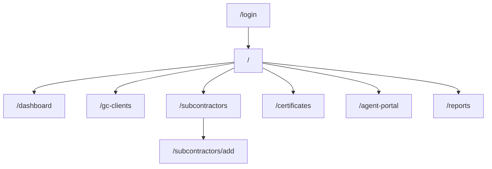

# SubGuard


**SubGuard** is a lightweight, cloud-ready subcontractor insurance compliance platform for construction consultants and small-to-mid-size general contractors. It automates Workers' Compensation and General Liability certificate verification, sends renewal requests to insurance agents via one-click email links, and provides real-time compliance dashboards — replacing the spreadsheets, phone calls, and manual certificate chasing that consume hours per payment cycle.

## Route Structure



## Getting Started

### Prerequisites

- Node.js 18+
- npm 9+

### Install & Run

```bash
git clone <repo-url>
cd subguard
npm install
npm run dev
```

### Demo Credentials

| Email | Role |
|-------|------|
| dawn@subguard.io | Consultant |
| sarah@acentralabs.com | Admin |
| mark@tvbuilders.com | Contractor |
| tom@beckettins.com | Agent |

Any password works in demo mode.

## Tech Stack

| Library | Version | Purpose |
|---------|---------|---------|
| React | 18+ | UI component library |
| Vite | 8 | Build tool & dev server |
| TailwindCSS | 4 | Utility-first CSS framework |
| React Router | 6 | Client-side routing |

## Project Structure

```
subguard/
├── index.html                 # Entry HTML
├── vite.config.js             # Vite + Tailwind plugin config
├── vercel.json                # SPA rewrite rules
├── src/
│   ├── main.jsx               # React DOM entry
│   ├── App.jsx                # Router + providers
│   ├── index.css              # Tailwind imports + theme
│   ├── contexts/
│   │   ├── AuthContext.jsx    # Auth state & demo login
│   │   └── DataContext.jsx    # App data state & CRUD ops
│   ├── components/
│   │   ├── layout/
│   │   │   └── MainLayout.jsx # Sidebar + header + footer
│   │   └── shared/
│   │       ├── Toast.jsx      # Toast notifications
│   │       ├── StatusBadge.jsx # Color-coded status pills
│   │       ├── StatCard.jsx   # KPI metric cards
│   │       └── EmptyState.jsx # Empty list placeholder
│   ├── pages/
│   │   ├── Login.jsx          # Auth page with demo accounts
│   │   ├── Dashboard.jsx      # Compliance overview
│   │   ├── GCClients.jsx      # GC management
│   │   ├── Subcontractors.jsx # Sub list with cert status
│   │   ├── AddSubcontractor.jsx # Sub registration form
│   │   ├── Certificates.jsx   # Certificate tracking
│   │   ├── AgentPortal.jsx    # No-login agent response
│   │   └── Reports.jsx        # Compliance reports
│   ├── data/
│   │   └── mockData.js        # Realistic Idaho construction data
│   └── utils/
│       └── helpers.js         # Date, currency, validation utils
├── supabase/
│   └── schema-stub.sql        # Full database schema with RLS
└── docs/
    ├── technical.md           # Architecture & data model docs
    └── user-guide.md          # Non-technical user guide
```

## Environment Variables

For future Supabase integration:

```env
VITE_SUPABASE_URL=https://your-project.supabase.co
VITE_SUPABASE_ANON_KEY=your-anon-key
VITE_SENDGRID_API_KEY=your-sendgrid-key
```

## Deployment

### Vercel

```bash
npm run build
# Output: dist/
# Framework: Vite
# Build command: npm run build
# Output directory: dist
```

The included `vercel.json` handles SPA routing rewrites.

## Available Scripts

| Script | Command | Description |
|--------|---------|-------------|
| dev | `npm run dev` | Start dev server with HMR |
| build | `npm run build` | Production build to `dist/` |
| preview | `npm run preview` | Preview production build locally |

## Contributing

1. Create a feature branch from `main`
2. Follow existing code patterns (functional components, Tailwind classes)
3. Ensure `npm run build` passes with zero errors
4. Submit a PR with description of changes

## License

See [LICENSE](LICENSE) file.

---

Built by [Acentra Labs](https://acentralabs.com)
