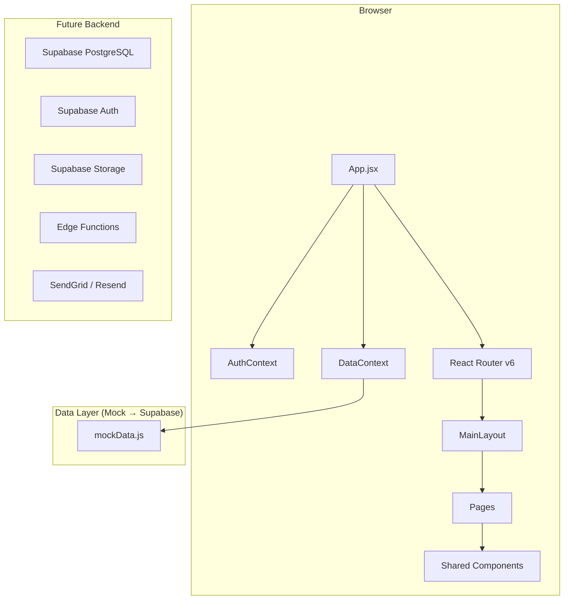
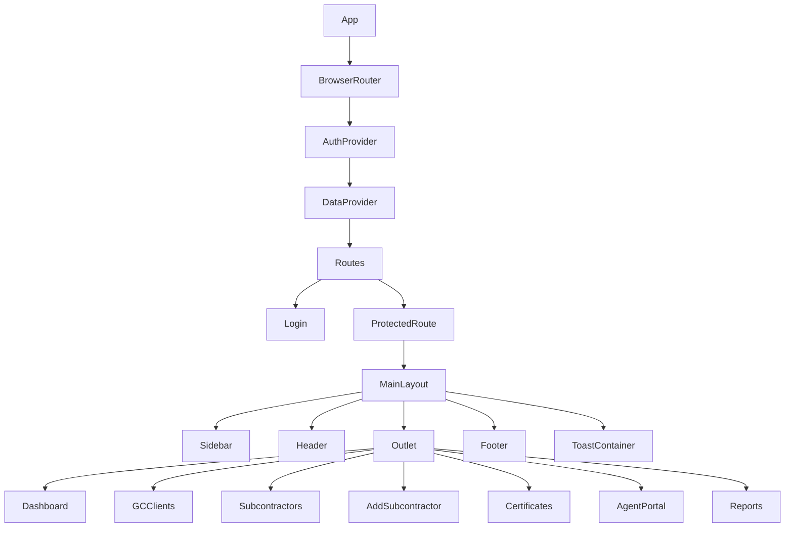
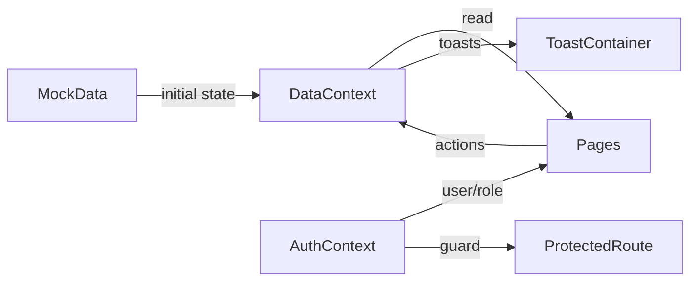
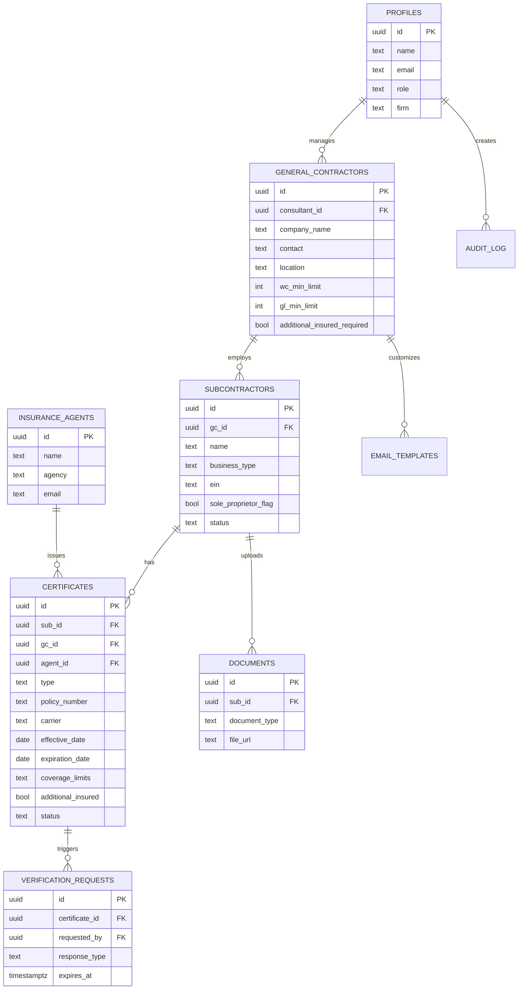

# SubGuard — Technical Documentation

## Architecture Overview

## Component Hierarchy

## Data Flow

## Frontend Architecture

### Routing

| Route | Component | Access |
|-------|-----------|--------|
| `/login` | Login | Public |
| `/dashboard` | Dashboard | Authenticated |
| `/gc-clients` | GCClients | Authenticated |
| `/subcontractors` | Subcontractors | Authenticated |
| `/subcontractors/add` | AddSubcontractor | Authenticated |
| `/certificates` | Certificates | Authenticated |
| `/agent-portal` | AgentPortal | Authenticated (public in production) |
| `/reports` | Reports | Authenticated |

### State Management

- **AuthContext**: Manages user session, login/logout, role. Persists to `localStorage`.
- **DataContext**: Holds all application data (GCs, subs, certificates, verification requests). Provides CRUD operations and toast notifications.

### Component Patterns

- Functional components only (React 18+ hooks)
- Shared components in `components/shared/` for reuse
- Layout component uses React Router `<Outlet />` for nested routing
- Toast system via context with auto-dismiss (4s timeout)

## Data Model

### Entity Relationship Diagram

### Field Types & Relationships

| Entity | Key Fields | Relationships |
|--------|-----------|---------------|
| profiles | id, name, email, role, firm | Has many GCs (consultant role) |
| general_contractors | id, consultant_id, company_name, wc_min_limit, gl_min_limit | Belongs to consultant; has many subs |
| subcontractors | id, gc_id, name, business_type, ein, sole_proprietor_flag, status | Belongs to GC; has many certificates |
| insurance_agents | id, name, agency, email | Has many certificates |
| certificates | id, sub_id, gc_id, type (WC/GL), policy_number, status | Belongs to sub, GC, and agent |
| verification_requests | id, certificate_id, response_type, expires_at | Belongs to certificate |
| documents | id, sub_id, document_type (W9/COI), file_url | Belongs to sub |
| email_templates | id, gc_id, template_type, merge_fields | Belongs to GC |
| audit_log | id, entity_type, entity_id, action, details | References any entity |

## Supabase Migration Plan

### Table Mapping

| Mock Data Key | Supabase Table | Notes |
|--------------|----------------|-------|
| consultants | profiles | Extends `auth.users` via FK |
| gcClients | general_contractors | consultant_id references profiles |
| insuranceAgents | insurance_agents | Standalone |
| subcontractors | subcontractors | gc_id references GC |
| certificates | certificates | Composite FK to sub + GC + agent |
| verificationRequests | verification_requests | 7-day expiry default |
| emailTemplates | email_templates | Per-GC customization |

### RLS Strategy

- `profiles`: Users can read own profile
- `general_contractors`: Consultants see own GCs; admins see all
- `subcontractors`: Access follows GC ownership chain
- `certificates`: Access follows GC ownership chain
- Agent portal routes bypass RLS via service-role key in Edge Functions

### Auth Strategy

- Supabase Auth with email/password
- Role stored in `profiles.role` (not in JWT claims for simplicity)
- Protected routes check `useAuth()` on the frontend
- RLS policies enforce data isolation on the backend

## API Integration Points

| Location | Current | Future |
|----------|---------|--------|
| AuthContext.login() | Mock lookup | `supabase.auth.signInWithPassword()` |
| DataContext state | In-memory from mockData | `supabase.from('table').select()` |
| DataContext.addSubcontractor() | State push | `supabase.from('subcontractors').insert()` |
| DataContext.updateCertificateStatus() | State map | `supabase.from('certificates').update()` |
| DataContext.sendVerificationRequest() | State push + toast | Edge Function → SendGrid email |
| AgentPortal actions | State updates | Public Edge Function with token validation |
| Reports export | Toast only | Generate CSV/PDF server-side |

## Dependencies

| Package | Purpose |
|---------|---------|
| react | UI component library |
| react-dom | DOM rendering |
| react-router-dom | Client-side SPA routing |
| tailwindcss | Utility CSS framework |
| @tailwindcss/vite | Vite plugin for Tailwind v4 |
| vite | Build tool and dev server |
| @vitejs/plugin-react | React JSX transform for Vite |

## Performance Notes

- Single-page app with code in one bundle (~87KB gzipped)
- Consider route-based code splitting via `React.lazy()` when app grows
- Mock data loads synchronously; Supabase queries will need loading states
- Toast auto-dismiss prevents memory leaks from accumulating notifications

## Security Considerations

- Demo mode uses localStorage for session — production must use Supabase Auth tokens
- Agent portal links should include signed tokens with 7-day expiry
- File uploads must validate MIME type and size server-side
- RLS policies are the primary authorization layer — frontend checks are convenience only
- EIN/Tax ID data is PII — encrypt at rest in production
- CORS and CSP headers should be configured on Vercel deployment

## Future Architecture

When Supabase backend is added:

1. Replace `mockData.js` imports with Supabase client queries
2. Add loading/error states to all data-fetching components
3. Implement real-time subscriptions for dashboard updates
4. Add Edge Functions for email workflows (SendGrid/Resend)
5. Enable Supabase Storage for COI/W9 file uploads
6. Add pg_cron for expiration alert scheduling
7. Implement proper RBAC middleware in Edge Functions
